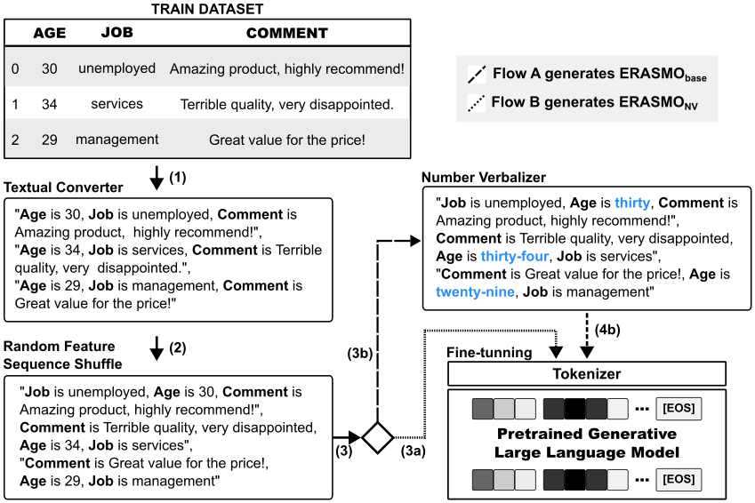
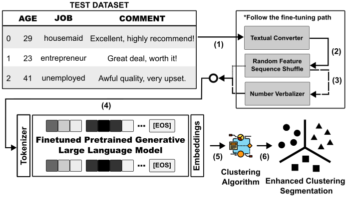

# ERASMO: A Framework for Generating High-Quality Embeddings from Tabular Data Using Transformer-Based Language Models

ERASMO is a framework designed to produce high-quality embeddings from tabular data by leveraging the power of transformer-based language models. This framework can be applied to various downstream tasks, such as clustering analysis, by generating robust and informative embeddings.

## ERASMO Framework

ERASMO consists of two primary stages: fine-tuning a pretrained language model on textually encoded tabular data and generating embeddings for downstream tasks. The framework is available in two versions: ERASMO<sub>base</sub> and ERASMO<sub>NV</sub>, the latter incorporating a number verbalizer step to enhance embedding quality.

### Stage 1: Fine-Tuning the Pretrained Language Model

In this stage, a pretrained transformer-based language model (e.g., LLaMA, GPT-3.5) is fine-tuned on tabular data that has been encoded into a textual format. This process involves adapting the model to understand and represent the nuances of the tabular data effectively. The steps include:

1. **Textual Converter:** Each row of the tabular dataset is converted into a textual representation by transforming each feature and its value into a subject-predicate-object format.

2. **Random Feature Sequence Shuffle:** The order of the textually encoded features is randomly shuffled to eliminate any spatial ordering bias inherent in the tabular data.

3. **Number Verbalization (ERASMO<sub>NV</sub>):** Numerical values are converted into their verbalized textual equivalents to ensure the model can effectively process and understand numerical information.

4. **Model Fine-Tuning:** The pretrained model is fine-tuned on the textually encoded and shuffled data, allowing it to learn the specific patterns and structures present in the tabular data.

<p align="center">

</p>

### Stage 2: Generating Embeddings for Clustering Analysis

After fine-tuning, the model is used to generate embeddings for the tabular data. These embeddings serve as high-quality representations that can be utilized in various downstream applications. The steps include:

1. **Embedding Generation:** Use the fine-tuned model to generate embeddings for the tabular data. These embeddings capture the complex relationships and patterns within the data.

2. **Downstream Tasks:** Apply the generated embeddings to various tasks such as clustering, classification, and regression. The high-quality embeddings improve the performance and robustness of these tasks.

<p align="center">

</p>

By following these stages, ERASMO provides a powerful and flexible framework for transforming tabular data into meaningful and high-quality embeddings, enabling better performance in a wide range of data analysis and machine learning applications.


### Reproducibility

To ensure the reproducibility of the ERASMO framework and its approaches (baselines), follow these steps:

1. **Installing Python and Dependencies**

   #### Python

   ```bash
   pyenv local 3.10.0
   python -m venv . (inside the ERASMO folder)
   source ./bin/activate
   python -m pip install -r requirements.txt

### Running the Baselines

Implementations of the baseline approaches are located in the `src/baselines` directory. 
To run the baselines, navigate to the `src/baselines` directory.

### Jupyter Notebook

For an interactive exploration and demonstration of the ERASMO framework, you can use the Jupyter Notebook provided: [**ERASMO Yelp Notebook**](https://github.com/fsant0s/ERASMO/blob/main/src/notebook/yelp.ipynb)

## Acknowledgements
...
<!---
This project was supported by the Ministry of Science, Technology, and Innovation of Brazil, with resources granted by the Federal Law 8.248 of October 23, 1991, under the PPI-Softex. The project was coordinated by Softex and published as Intelligent agents for mobile platforms based on Cognitive Architecture technology [01245.013778/2020-21].
-->

## Citation
```bash
...
```